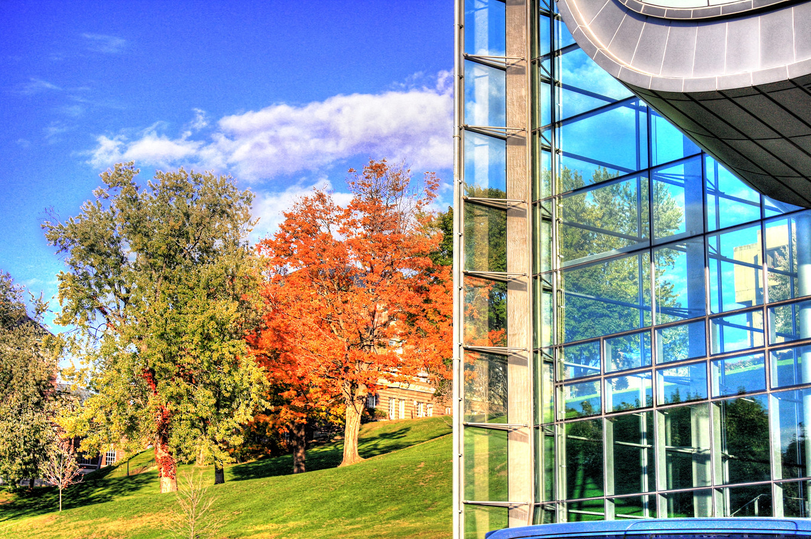

# kmeans - stylized images using image segmentation and pixelation

This project implements an algorithm for stylizing images that clusters pixels by color, then maps each cluster to another color.
Optionally, the image can be downsampled prior to mapping colors, which produces a pixelated effect when reupscaled.


<table>
	<tr>
		<th>Before</th>
		<th>After</th>
	</tr>
	<tr>
		<td></td>
		<td></td>
	</tr>
</table>

Photograph taken by Daniel Mennerich ([Flickr](https://flic.kr/p/2oBWGQv)).

## setup

It is recommended to use a [virtual environment](https://docs.python.org/3/library/venv.html) to manage dependencies.

```sh
python -m venv venv
source venv/bin/activate
python -m pip install -r requirements.txt
```

## usage

Run this project using any Python interpreter.

```
python kmeans.py
```

### arguments

| argument | description | default value |
| --- | --- | --- |
| `filename` | `str`: The filename of the image to run the algorithm on. | `None` (required) |
| `palette` | `int \| str`: Either the number of colors to use for an auto-generated palette, or the name of a builtin palette (see [palettes](palettes)). | `16` |
| `pixelsize` | `int \| None`: If `int`, the size of each pixel after reupsampling. If `None`, no downsampling is performed. | `None` |


## palettes

| palette | description |
| --- | --- | 
| `latte` | Catppuccin Latte |
| `macchiato` | Catppuccin Macchiato |

## acknowledgments 

- [Catppuccin](https://catppuccin.com/palette)
